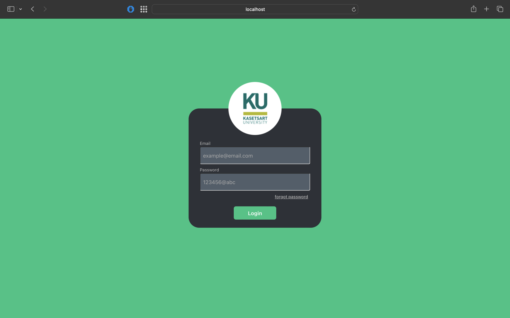

# Login Page Project

This project is a simple login page built with React for the frontend and Node.js for the backend.

## Features
- User login
- Responsive design
- Simple backend API

## Installation

To run this project locally, follow these steps:

1. Clone the repository:
    ```bash
    git clone https://github.com/Worawit-Nantasu/Login-Page.git
    cd Login-Page
    ```

2. Install dependencies for the backend:
    ```bash
    cd backend
    npm install
    npm run dev
    ```

3. Install dependencies for the frontend:
    ```bash
    cd frontend
    npm install
    npm run dev
    ```

## Screenshot
Here is a screenshot of the login page:



## Usage

1. Open your browser and go to `http://localhost:5173` to see the login page.
2. Enter your email and password to login.

## License
This project is licensed under the MIT License - see the [LICENSE](LICENSE) file for details.
